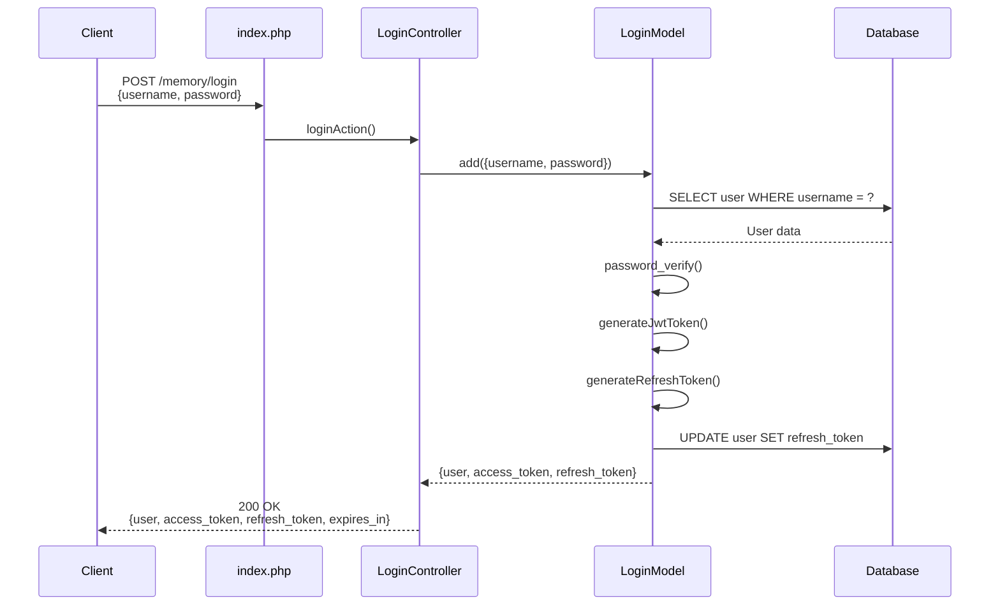
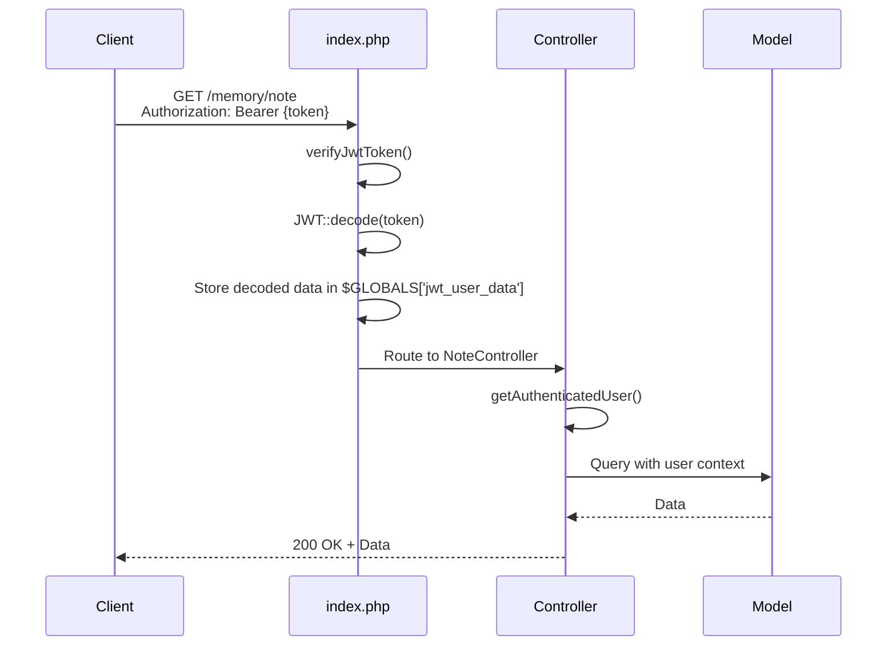
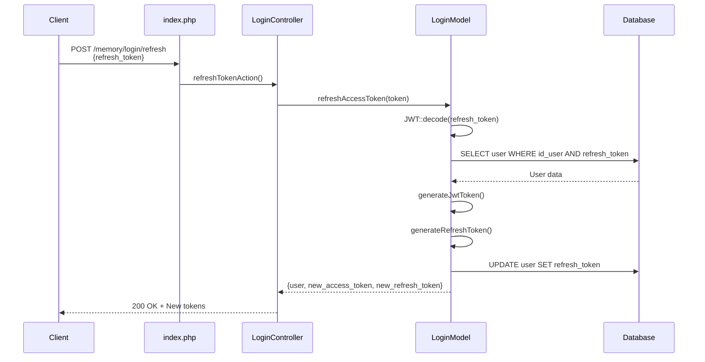
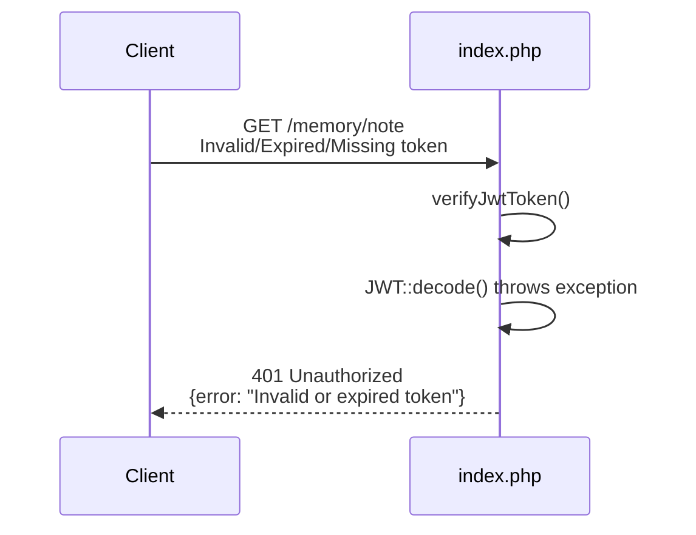

# JWT (JSON Web Token) - Implémentation dans Memory API

## Table des matières
- [Qu'est-ce qu'un JWT ?](#quest-ce-quun-jwt-)
- [Structure d'un JWT](#structure-dun-jwt)
- [Implémentation dans Memory API](#implémentation-dans-memory-api)
- [Contenu du JWT dans ce projet](#contenu-du-jwt-dans-ce-projet)
- [Flux d'authentification](#flux-dauthentification)
- [Configuration](#configuration)
- [Sécurité](#sécurité)

## Qu'est-ce qu'un JWT ?

Un **JSON Web Token (JWT)** est un standard ouvert ([RFC 7519](https://tools.ietf.org/html/rfc7519)) qui définit une manière compacte et autonome de transmettre de manière sécurisée des informations entre deux parties sous forme d'objet JSON. Ces informations peuvent être vérifiées et approuvées car elles sont signées numériquement.

### Caractéristiques principales

- **Compact** : Peut être envoyé via une URL, un paramètre POST ou dans un en-tête HTTP
- **Autonome** : Contient toutes les informations nécessaires sur l'utilisateur, évitant de requêter la base de données à chaque requête
- **Sécurisé** : Signé avec une clé secrète (HMAC) ou une paire de clés publique/privée (RSA)

### Cas d'utilisation

- **Authentification** : Une fois connecté, chaque requête inclut le JWT, permettant d'accéder aux ressources autorisées
- **Échange d'informations** : Les JWT sont signés, garantissant l'intégrité des données transmises

## Structure d'un JWT

Un JWT est composé de trois parties séparées par des points (`.`) :

```
xxxxx.yyyyy.zzzzz
```

### 1. Header (En-tête)

Contient le type de token et l'algorithme de signature :

```json
{
  "alg": "HS256",
  "typ": "JWT"
}
```

### 2. Payload (Charge utile)

Contient les "claims" (déclarations) - informations sur l'entité et métadonnées :

```json
{
  "iat": 1737734400,
  "exp": 1737820800,
  "iss": "memory-api",
  "aud": "memory-frontend",
  "data": {
    "id_user": 42,
    "username": "john_doe",
    "role": "developer"
  }
}
```

### 3. Signature

Créée en combinant :
- L'en-tête encodé
- Le payload encodé
- Une clé secrète
- L'algorithme spécifié dans l'en-tête

```
HMACSHA256(
  base64UrlEncode(header) + "." + base64UrlEncode(payload),
  secret
)
```

## Implémentation dans Memory API

### Bibliothèque utilisée

Le projet utilise la bibliothèque **firebase/php-jwt** (version 5.5+), référencée dans `composer.json` :

```json
{
  "require": {
    "firebase/php-jwt": "^5.5"
  }
}
```

### Fichiers clés

| Fichier | Rôle |
|---------|------|
| `inc/config.php` | Définit les constantes de configuration JWT |
| `Models/LoginModel.php` | Génère les tokens lors de la connexion |
| `index.php` | Vérifie les tokens pour chaque requête |
| `Controllers/Api/BaseController.php` | Fournit des méthodes d'accès aux données du token |

## Contenu du JWT dans ce projet

### Access Token (Token d'accès)

Le token d'accès contient les informations suivantes :

```json
{
  "iat": 1737734400,
  "exp": 1737738000,
  "iss": "memory-api",
  "aud": "memory-frontend",
  "data": {
    "id_user": 42,
    "username": "john_doe",
    "role": "developer"
  }
}
```

#### Claims standards (RFC 7519)

- **`iat`** (Issued At) : Timestamp de création du token
- **`exp`** (Expiration Time) : Timestamp d'expiration du token
- **`iss`** (Issuer) : Émetteur du token (configuré via `JWT_ISSUER`)
- **`aud`** (Audience) : Destinataire prévu du token (configuré via `JWT_AUDIENCE`)

#### Claims personnalisés

- **`data.id_user`** : Identifiant unique de l'utilisateur
- **`data.username`** : Nom d'utilisateur
- **`data.role`** : Rôle de l'utilisateur (ex: `developer`, `admin`, `projectManager`)

### Refresh Token

Le refresh token a une structure similaire mais avec des différences :

```json
{
  "iat": 1737734400,
  "exp": 1740326400,
  "iss": "memory-api",
  "aud": "memory-frontend",
  "data": {
    "id_user": 42,
    "username": "john_doe",
    "type": "refresh"
  }
}
```

**Différences clés :**
- Durée de vie plus longue (30 jours par défaut)
- Contient `type: "refresh"` pour l'identifier
- Ne contient pas le rôle (sécurité renforcée)
- Stocké en base de données dans la table `user`

## Flux d'authentification

### 1. Connexion initiale



**Réponse typique :**

```json
{
  "id_user": 42,
  "username": "john_doe",
  "email": "john@example.com",
  "role_name": "Développeur",
  "role_value": "developer",
  "access_token": "eyJ0eXAiOiJKV1QiLCJhbGc...",
  "refresh_token": "eyJ0eXAiOiJKV1QiLCJhbGc...",
  "token_type": "Bearer",
  "expires_in": 3600
}
```

### 2. Requêtes authentifiées



### 3. Rafraîchissement du token

Lorsque l'access token expire, le client peut utiliser le refresh token :



### 4. Gestion des erreurs

Si le token est invalide, expiré ou absent :



## Configuration

### Variables d'environnement (fichier `.env`)

```env
# JWT Configuration
JWT_SECRET_KEY=your_very_secure_secret_key_here
JWT_ALGORITHM=HS256
JWT_EXPIRATION_TIME=3600
JWT_ISSUER=memory-api
JWT_AUDIENCE=memory-frontend
```

### Constantes définies (`inc/config.php`)

```php
define("JWT_SECRET_KEY", $_ENV['JWT_SECRET_KEY']);
define("JWT_ALGORITHM", $_ENV['JWT_ALGORITHM']);
define("JWT_EXPIRATION_TIME", $_ENV['JWT_EXPIRATION_TIME']);
define("JWT_ISSUER", $_ENV['JWT_ISSUER']);
define("JWT_AUDIENCE", $_ENV['JWT_AUDIENCE']);
define("JWT_REFRESH_EXPIRATION_TIME", 30*24*60*60); // 30 jours
```

### Détails de configuration

| Paramètre | Valeur recommandée | Description |
|-----------|-------------------|-------------|
| `JWT_SECRET_KEY` | Chaîne aléatoire de 64+ caractères | Clé secrète pour signer les tokens (CRITIQUE) |
| `JWT_ALGORITHM` | `HS256` | Algorithme de hachage HMAC SHA-256 |
| `JWT_EXPIRATION_TIME` | `3600` (1 heure) | Durée de vie de l'access token en secondes |
| `JWT_ISSUER` | `memory-api` | Identifiant du serveur émetteur |
| `JWT_AUDIENCE` | `memory-frontend` | Application cliente autorisée |
| `JWT_REFRESH_EXPIRATION_TIME` | `2592000` (30 jours) | Durée de vie du refresh token |

## Sécurité

### Bonnes pratiques implémentées

#### 1. **Vérification systématique**
Tous les endpoints (sauf `/login` et `/view`) vérifient le token dans `index.php` :

```php
if ($uri[2] !== 'login' && $uri[2] !== 'view') {
    $decodedToken = verifyJwtToken();
    $GLOBALS['jwt_user_data'] = $decodedToken->data ?? null;
}
```

#### 2. **Multiples sources d'authentification**
Le système accepte le token depuis :
- En-tête `Authorization: Bearer {token}` (recommandé)
- Cookie `auth-token` (fallback)

```php
$authHeader = $headers['authorization'] ?? $_SERVER['HTTP_AUTHORIZATION'] ?? null;

if (!$authHeader && isset($_COOKIE['auth-token'])) {
    $authHeader = 'Bearer ' . $_COOKIE['auth-token'];
}
```

#### 3. **Gestion sécurisée des mots de passe**
```php
// Hachage avec bcrypt lors de l'inscription
$hashed_password = password_hash($password, PASSWORD_DEFAULT);

// Vérification sécurisée lors de la connexion
$isPasswordValid = password_verify($password, $user->password);
```

#### 4. **Logging de sécurité**
Toutes les opérations sensibles sont enregistrées via `SecurityLogger` :

```php
// Connexion réussie
$logger->logLoginSuccess($username, $user->id_user);

// Échec d'authentification
$logger->logLoginFailure($username, 'Invalid credentials');

// Validation de token échouée
$logger->logTokenValidationFailure($e->getMessage(), $token);

// Rafraîchissement de token
$logger->logTokenRefresh($user->id_user, $user->username);
```

#### 5. **Contrôle d'accès basé sur les rôles (RBAC)**
Les contrôleurs utilisent les méthodes du `BaseController` :

```php
protected function getAuthenticatedUser() {
    return $GLOBALS['jwt_user_data'] ?? null;
}

protected function hasUserModificationPermission(): bool {
    $currentUser = $this->getAuthenticatedUser();
    return in_array($currentUser->role, ['projectManager', 'admin']);
}

protected function hasPermission($requiredRole): bool {
    $user = $this->getAuthenticatedUser();
    return $user->role === $requiredRole;
}
```

#### 6. **Refresh token stocké en base**
Le refresh token est stocké dans la base de données, permettant :
- Révocation facile (suppression de la BDD)
- Vérification de validité (comparaison avec la BDD)
- Limitation à un seul token actif par utilisateur

```php
// Génération et stockage
$refreshToken = $this->generateRefreshToken($user);
$this->update("UPDATE user SET refresh_token = ? WHERE id_user = ?",
    ["si", $refreshToken, $user->id_user]);
```

### Recommandations de sécurité supplémentaires

#### 1. **HTTPS obligatoire en production**
Toujours utiliser HTTPS pour empêcher l'interception des tokens en transit.

#### 2. **Rotation de la clé secrète**
Changer périodiquement `JWT_SECRET_KEY` et invalider tous les tokens existants.

#### 3. **Liste noire de tokens (Token Blacklist)**
Implémenter un système de révocation pour les tokens compromis avant leur expiration.

#### 4. **Limiter la durée des tokens**
- Access token : court (1 heure par défaut) ✅
- Refresh token : moyen (30 jours) ✅

#### 5. **Validation stricte des claims**
Vérifier `iss`, `aud`, et `exp` lors du décodage (déjà fait par firebase/php-jwt).

#### 6. **Protection contre le CSRF**
Les tokens JWT dans les cookies doivent avoir l'attribut `SameSite=Strict`.

#### 7. **Taille du payload**
Éviter de stocker trop de données dans le JWT (performances et sécurité).

### Gestion des erreurs JWT

| Erreur | Code HTTP | Message |
|--------|-----------|---------|
| Header manquant | 401 | `Authorization header missing` |
| Format invalide | 401 | `Invalid authorization header format` |
| Token expiré | 401 | `Invalid or expired token: Expired token` |
| Signature invalide | 401 | `Invalid or expired token: Signature verification failed` |
| Token malformé | 401 | `Invalid or expired token: Wrong number of segments` |

## Exemple d'utilisation

### Frontend (JavaScript)

```javascript
// 1. Connexion
const loginResponse = await fetch('http://localhost/memory/login', {
  method: 'POST',
  headers: { 'Content-Type': 'application/json' },
  body: JSON.stringify({
    username: 'john_doe',
    password: 'secure_password'
  })
});

const { access_token, refresh_token, expires_in } = await loginResponse.json();

// Stocker les tokens (exemple avec localStorage)
localStorage.setItem('access_token', access_token);
localStorage.setItem('refresh_token', refresh_token);

// 2. Requête authentifiée
const notesResponse = await fetch('http://localhost/memory/note', {
  headers: {
    'Authorization': `Bearer ${localStorage.getItem('access_token')}`
  }
});

const notes = await notesResponse.json();

// 3. Gestion de l'expiration
if (notesResponse.status === 401) {
  // Token expiré, rafraîchir
  const refreshResponse = await fetch('http://localhost/memory/login/refresh', {
    method: 'POST',
    headers: { 'Content-Type': 'application/json' },
    body: JSON.stringify({
      refresh_token: localStorage.getItem('refresh_token')
    })
  });

  const newTokens = await refreshResponse.json();
  localStorage.setItem('access_token', newTokens.access_token);
  localStorage.setItem('refresh_token', newTokens.refresh_token);

  // Réessayer la requête initiale
}
```

### Vérification manuelle d'un token

Vous pouvez décoder et vérifier un token sur [jwt.io](https://jwt.io) :

1. Coller le token dans le décodeur
2. Entrer la clé secrète (`JWT_SECRET_KEY`)
3. Vérifier la signature et les claims

## Conclusion

L'implémentation JWT dans Memory API suit les standards de l'industrie et intègre des mécanismes de sécurité robustes :

- ✅ Tokens signés avec HMAC SHA-256
- ✅ Refresh tokens pour une meilleure expérience utilisateur
- ✅ Logging exhaustif des événements de sécurité
- ✅ Contrôle d'accès basé sur les rôles
- ✅ Gestion sécurisée des mots de passe
- ✅ Protection contre les attaques courantes

Cette architecture permet une authentification stateless, scalable et sécurisée pour l'API RESTful.
