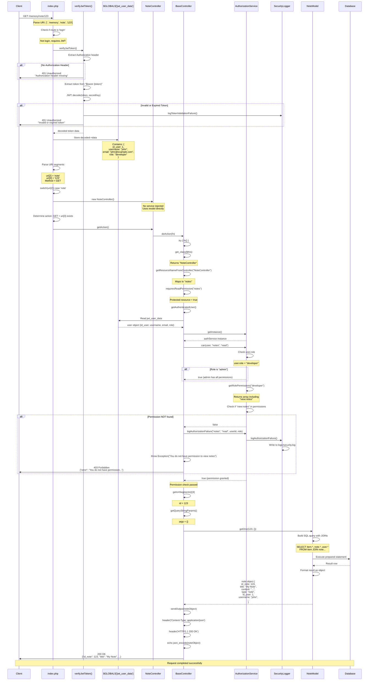
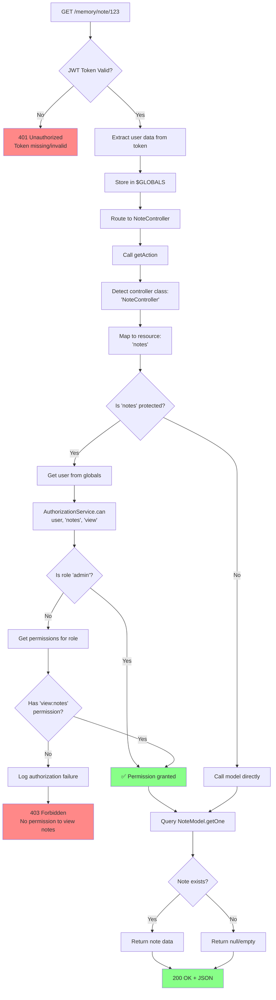
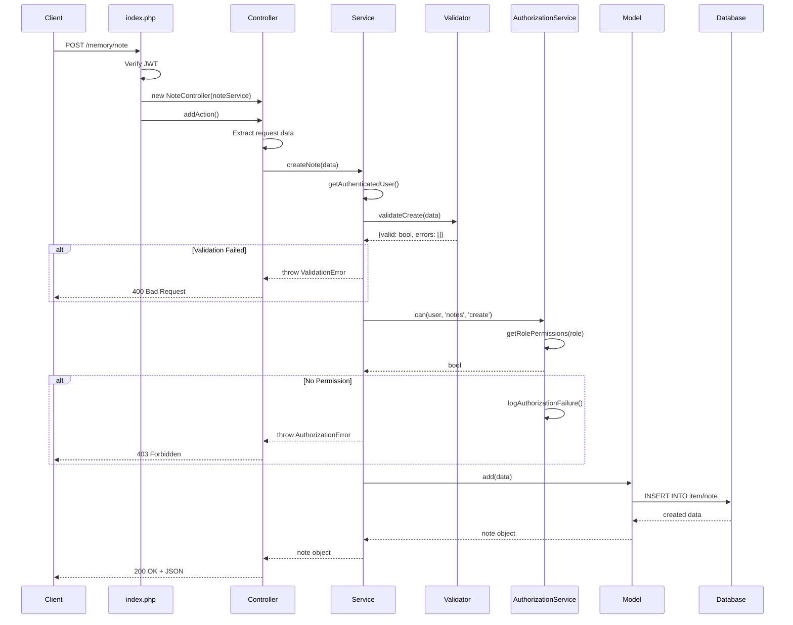
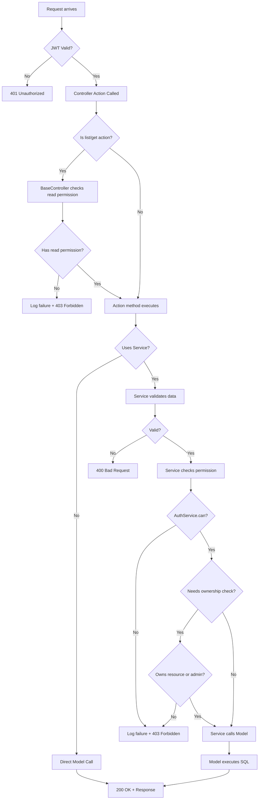

# Service Layer Architecture - Class Diagram

## Overview

This diagram illustrates the service layer architecture implementing separation of concerns with controllers, services, validators, and models.

## GET Note Route - Complete Flow

This sequence diagram shows the complete flow of a `GET /memory/note/123` request, including JWT validation, role extraction, and permission checking.



## Authorization Decision Tree



## Architecture Diagram

```mermaid
classDiagram
    %% Base Classes
    class BaseController {
        #model
        #getAuthenticatedUser()
        #getCurrentUserId()
        #getCurrentUserRole()
        #hasUserModificationPermission()
        #hasPermission(requiredRole)
        #getResourceNameFromController(controllerClass)
        #requiresReadPermission(resourceName)
        #getUriSegments()
        #getQueryStringParams()
        #getRequestBody(name)
        #sanitizeInput(value)
        #sendOutput(data, httpHeaders)
        #getQueryString(name, default)
        #doAction(fn, args)
        +listAction(args)
        +getAction()
        +removeAction()
    }

    class BaseService {
        #authorizationService
        #validationService
        #getAuthenticatedUser()
        #getCurrentUserId()
        #getCurrentUserRole()
        #throwValidationError(message)
        #throwAuthorizationError(message)
    }

    class Database {
        #connection
        #baseQuery
        +select(query, params)
        +selectOne(query, params)
        +insert(query, params)
        +update(query, params)
        +delete(query, params)
    }

    class IModel {
        <<interface>>
        +getAll(args)
        +getOne(id, args)
        +add(paramsArray)
        +modify(paramsArray)
        +remove(id)
    }

    %% Authorization Service (Singleton)
    class AuthorizationService {
        -roleModel
        -instance$
        +getInstance()$
        +can(user, resource, action) bool
        +owns(user, resourceOwnerId) bool
        +canModify(user, resourceOwnerId) bool
        +logAuthorizationFailure(resource, action, userId, role)
        -getRolePermissions(role) array
    }

    %% Validators
    class NoteValidator {
        +validateCreate(data) array
        +validateUpdate(data) array
    }

    class UserValidator {
        -userModel
        +validateCreate(data) array
        +validateUpdate(data) array
    }

    class ProjectValidator {
        +validateCreate(data) array
        +validateUpdate(data) array
    }

    %% Services
    class NoteService {
        -noteModel
        -validator
        +createNote(data) array
        +updateNote(noteId, data) array
        +deleteNote(noteId) bool
        +shareNote(data) mixed
    }

    class UserService {
        -userModel
        -validator
        +createUser(data) array
        +updateUser(userId, data) array
        +deleteUser(userId) bool
    }

    class ProjectService {
        -projectModel
        -validator
        +createProject(data) array
        +updateProject(projectId, data) array
        +deleteProject(projectId) bool
        +addUsersToProject(data) mixed
        +removeUsersFromProject(data) mixed
    }

    %% Models
    class NoteModel {
        +getAll(args) array
        +getOne(id, args) object
        +add(paramsArray) array
        +modify(paramsArray) array
        +remove(id) bool
        +shareNoteWithUser(data) mixed
    }

    class UserModel {
        +getAll(args) array
        +getOne(id, args) object
        +add(paramsArray) array
        +modify(paramsArray) array
        +remove(id) bool
        +validate(data) array
        +validateUpdate(data) array
    }

    class ProjectModel {
        +getAll(args) array
        +getOne(id, args) object
        +add(paramsArray) array
        +modify(paramsArray) array
        +remove(id) bool
        +addToProject(data) mixed
        +deleteFromProject(data) mixed
    }

    %% Controllers
    class NoteController {
        -noteService
        +addAction()
        +updateAction()
        +removeAction()
        +shareNoteWithUser()
    }

    class UserController {
        -userService
        +addAction()
        +updateAction()
        +removeAction()
    }

    class ProjectController {
        -projectService
        +addAction()
        +updateAction()
        +removeAction()
        +addProjectToUser()
        +removeProjectFromUser()
    }

    %% Inheritance Relationships
    BaseController <|-- NoteController
    BaseController <|-- UserController
    BaseController <|-- ProjectController

    BaseService <|-- NoteService
    BaseService <|-- UserService
    BaseService <|-- ProjectService

    Database <|-- NoteModel
    Database <|-- UserModel
    Database <|-- ProjectModel

    IModel <|.. NoteModel
    IModel <|.. UserModel
    IModel <|.. ProjectModel

    %% Composition Relationships
    NoteController *-- NoteService : uses
    UserController *-- UserService : uses
    ProjectController *-- ProjectService : uses

    NoteService *-- NoteModel : uses
    NoteService *-- NoteValidator : uses
    NoteService ..> AuthorizationService : depends on

    UserService *-- UserModel : uses
    UserService *-- UserValidator : uses
    UserService ..> AuthorizationService : depends on

    ProjectService *-- ProjectModel : uses
    ProjectService *-- ProjectValidator : uses
    ProjectService ..> AuthorizationService : depends on

    UserValidator ..> UserModel : validates with

    %% Notes
    note for BaseController "Provides common HTTP handling\nand automatic permission checks\nfor list/get actions"

    note for AuthorizationService "Singleton pattern\nCentralized RBAC:\n- admin: all permissions\n- projectManager: full CRUD\n- leadDeveloper: limited CRUD\n- developer: basic CRUD"

    note for BaseService "Provides common service\nfunctionality and user context"

    note for NoteService "Enforces business rules:\n- Field validation\n- Permission checks\n- Ownership verification"
```



## Data Flow



## Permission Flow



## Key Architectural Principles

### 1. Separation of Concerns
- **Controllers**: HTTP handling, request/response formatting
- **Services**: Business logic, validation, authorization
- **Validators**: Data validation rules
- **Models**: Database operations only
- **AuthorizationService**: Centralized permission management

### 2. Dependency Injection
- Services injected into controllers via constructor
- Models injected into services
- Validators instantiated within services

### 3. Single Responsibility
- Each class has one clear purpose
- Validators only validate
- Services only handle business logic
- Models only interact with database

### 4. Security Layers
1. **JWT verification** (index.php)
2. **BaseController read permissions** (list/get actions)
3. **Service-level authorization** (CRUD operations)
4. **Ownership verification** (update/delete)
5. **Audit logging** (all authorization failures)

### 5. Gradual Migration
- BaseController provides fallback for non-migrated controllers
- Services can be added incrementally
- Existing functionality preserved during migration

## Resource Permission Matrix

| Role            | create:notes | view:notes | update:notes | delete:notes | create:projects | view:projects | update:projects | delete:projects |
|-----------------|--------------|------------|--------------|--------------|-----------------|---------------|-----------------|-----------------|
| admin           | ✅           | ✅         | ✅           | ✅           | ✅              | ✅            | ✅              | ✅              |
| projectManager  | ✅           | ✅         | ✅           | ✅           | ✅              | ✅            | ✅              | ✅              |
| leadDeveloper   | ✅           | ✅         | ✅*          | ✅*          | ❌              | ✅            | ❌              | ❌              |
| developer       | ✅           | ✅         | ✅*          | ✅*          | ❌              | ✅            | ❌              | ❌              |

*Only own resources or if admin

## File Structure

```
memory/
├── Controllers/Api/
│   ├── BaseController.php          # Base with auto permission checks
│   ├── NoteController.php          # ✅ Migrated to services
│   ├── UserController.php          # ✅ Migrated to services
│   ├── ProjectController.php       # ✅ Migrated to services
│   └── ...OtherControllers.php     # 🔄 Not yet migrated
├── Services/
│   ├── BaseService.php             # Common service functionality
│   ├── AuthorizationService.php    # Singleton RBAC manager
│   ├── NoteService.php             # Note business logic
│   ├── NoteValidator.php           # Note validation
│   ├── UserService.php             # User business logic
│   ├── UserValidator.php           # User validation
│   ├── ProjectService.php          # Project business logic
│   └── ProjectValidator.php        # Project validation
├── Models/
│   ├── Database.php                # Base database class
│   ├── IModel.php                  # Model interface
│   ├── NoteModel.php               # Note repository
│   ├── UserModel.php               # User repository
│   └── ProjectModel.php            # Project repository
└── index.php                       # Router + DI container
```
